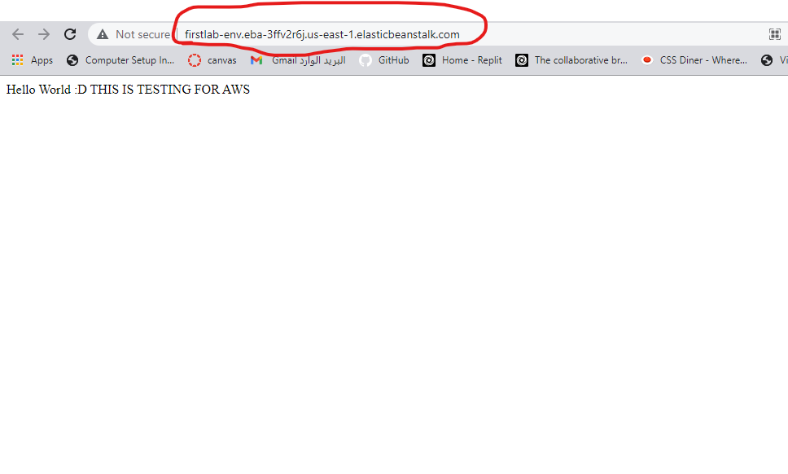

# cloud-server
#### Execute
## I creat a simple server to deploy on Elastic Beanstalk
Use "Elastic Beanstalk" to Deploy a NodeJS server to an EC2 instance at AWS

Deploy Link :
http://firstlab-env.eba-3ffv2r6j.us-east-1.elasticbeanstalk.com/

This requires 2 parts:

1. An "Environment" (container) for our application to run in
1. The application code itself to be deployed "into" the environment

### Creating an application with the Elastic Beanstalk GUI

- Choose NodeJS as your platform
- Create and upload a .zip file with your application source code
  - Do not include `node_modules` or `package-lock.json`

This will create your application and environment in one step, giving you a full GUI from where you can manage the app
